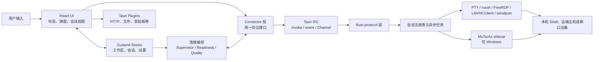
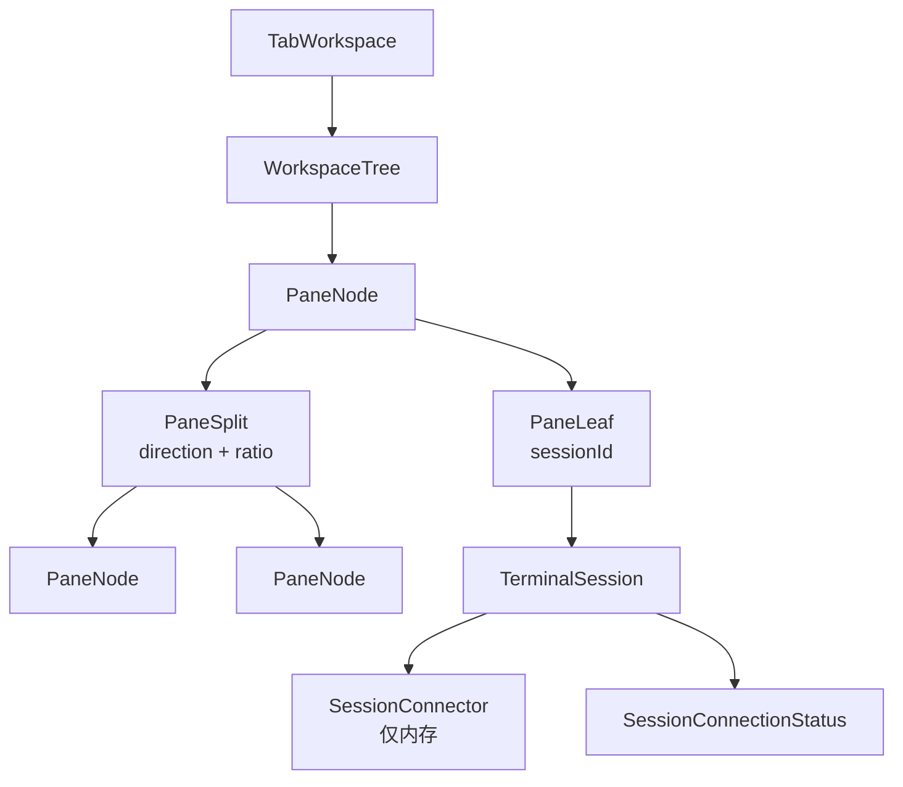

# 架构设计

> **简体中文** | [English](../en/developer/architecture.md)

| 项目 | 内容 |
| --- | --- |
| 文档状态 | 当前实现基线 |
| 对应版本 | `26.81.2912` |
| 最后更新 | 2026-08-12 |
| 适用范围 | React 前端、会话编排、Tauri IPC、Rust 协议后端、原生依赖与持久化 |

LazyTerm 是基于 Tauri 2、React 19、TypeScript 和 Rust 的桌面终端工作区。架构的核心不是简单的“前端调用后端”，而是把工作区布局、会话状态、连接生命周期和协议资源分开管理：

- 工作区决定会话显示在哪里。
- 会话 Store 保存应用运行时看到的状态。
- Connector 统一不同协议的操作接口。
- 连接编排服务处理重连、错误归类和资源预算。
- Rust 后端持有真实的 PTY、网络连接、FFI 客户端和 sidecar 进程。

## 设计原则

1. **UI 不直接依赖协议命令**：会话视图只通过 Connector 操作连接。
2. **连接状态只有一个应用级数据源**：`src/store/tabs.ts` 中的 `connectionStatus` 是 UI 判断连接结果的依据。
3. **配置与运行时资源分离**：持久化数据只能保存可序列化配置；Connector、监听器、任务句柄和原生资源只存在于内存。
4. **先建立监听，再启动后端**：避免快速失败、首帧或关闭事件早于前端订阅造成竞态。
5. **协议差异封装在边界内**：RDP、VNC、SSH 等差异由 Connector 和 Rust `protocol` 模块吸收。
6. **后台会话主动降载**：图形会话根据焦点、可见性和窗口状态动态调整帧率与图像质量。

## 系统概览



### 分层职责

| 层级 | 主要目录 | 职责 | 不应承担的职责 |
| --- | --- | --- | --- |
| 应用与 UI | `src/components/`、`src/hooks/` | 布局、输入、展示、视图生命周期 | 直接管理网络连接或 Rust 句柄 |
| 状态 | `src/store/` | 工作区、会话、配置和瞬时 UI 状态 | 实现协议细节 |
| 应用编排 | `src/services/connection/`、`src/lib/` | 重连、错误归类、质量策略、工作区模板 | 持有后端协议资源 |
| Connector | `src/connectors/` | 统一连接接口、事件订阅、IPC 参数转换 | 渲染具体 UI |
| IPC 服务 | `src/services/tauri.ts`、其他 `services/` | 封装调用、日志、调用顺序和应用服务 | 保存会话真相状态 |
| Rust 后端 | `src-tauri/src/protocol/` | PTY、网络协议、FFI、文件传输和系统操作 | 决定前端布局 |
| 原生边界 | `src-tauri/native/`、`*_ffi/` | Windows ActiveX sidecar、FreeRDP 和 LibVNCClient 集成 | 暴露原生句柄给 React |

依赖方向原则上由上到下。少数跨 Store 协作通过明确的应用级函数完成，例如 `tabs.ts` 与 `panes.ts` 的会话生命周期联动；不应在组件之间复制连接状态。

## 技术栈

| 领域 | 技术 |
| --- | --- |
| 桌面运行时 | Tauri 2 |
| 前端 | React 19、TypeScript 5.9、Vite 7 |
| 状态管理 | Zustand 5 |
| UI | Tailwind CSS 4、Radix UI、shadcn/ui、Framer Motion、lucide-react |
| 终端渲染 | xterm.js 6 |
| 后端 | Rust 2021、Tokio |
| 本地终端 | portable-pty |
| SSH / SFTP | russh、russh-sftp |
| 内嵌 RDP | FreeRDP FFI |
| Windows 原生 RDP | MsTscAx sidecar |
| VNC | LibVNCClient FFI；保留后端 feature 边界 |
| 串口 | serialport |

## 工作区、面板与会话模型

工作区和连接会话是两个独立模型：



- `tabs.ts` 管理标签页、会话元数据、Connector 引用、焦点会话和连接状态。
- `panes.ts` 为每个标签页维护一棵递归分屏树。叶子引用 `sessionId`，分裂节点保存方向和比例。
- `PaneContainer` 递归渲染分屏树，`PaneView` 根据会话类型选择终端、RDP 或 VNC 视图。
- `TabBar` 注册会话生命周期回调，使创建、关闭和焦点切换能够同步更新面板树。
- 活跃标签页和分屏树不持久化。需要复用的布局通过“工作区模板”捕获，并作为会话树中的配置保存。
- 工作区模板保存会话定义、递归布局、分屏比例、焦点会话和面板字体覆盖，不保存明文凭据。

## 会话连接架构

### Connector 统一接口

所有连接器实现 `ISessionConnector`：

```text
open() / close() / onConnectionState() / applyQualityPolicy?()
```

终端协议扩展为 `ITerminalConnector`，增加 `onData`、`write` 和 `resize`；RDP、VNC 和原生 RDP 分别暴露帧、输入、刷新、挂载等图形能力。

| 会话类型 | Connector | 前端视图 | Rust / 原生实现 |
| --- | --- | --- | --- |
| 本地终端 | `LocalConnector` | `TerminalViewClass` | portable-pty |
| SSH | `SshConnector` | `TerminalViewClass` | russh |
| AI CLI | `AiCliConnector` | `TerminalViewClass` | portable-pty 启动外部 CLI |
| Telnet | `TelnetConnector` | `TerminalViewClass` | Tokio TCP |
| 串口 | `SerialConnector` | `TerminalViewClass` | serialport |
| RDP / FreeRDP | `RdpConnector` | `RemoteDesktopViewClass` | FreeRDP FFI + Canvas |
| RDP / MsTscAx | `NativeRdpConnector` | `NativeRdpHostView` | Windows sidecar + 原生子窗口 |
| VNC | `VncConnector` | `VncViewClass` | LibVNCClient FFI + Canvas |

`ConnectorFactory` 是会话类型到实现的唯一工厂入口。它还负责解析凭据引用，并在 Windows 上按设置选择 FreeRDP 或 MsTscAx；非 Windows 平台强制使用 FreeRDP。

SFTP、应用更新、Git 同步和 AI 对话不是持续渲染的 `SessionConnector`。它们作为命令式应用服务，通过 Tauri command 或 Tauri HTTP 插件执行。

### 连接状态模型

连接状态由三个正交维度组成：

| 维度 | 值 | 用途 |
| --- | --- | --- |
| `phase` | `idle`、`connecting`、`authenticating`、`connected`、`reconnecting`、`disconnected`、`failed`、`closing` | 用户可见生命周期 |
| `stage` | `idle`、`resolving`、`transport`、`security`、`authentication`、`session`、`first-data`、`steady`、`closing` | 定位连接进行到哪一步 |
| `health` | `unknown`、`healthy`、`degraded`、`stalled` | 表示当前质量与可用程度 |

`ConnectionStateEmitter` 统一补全缺省 `stage` 和 `health`。Connector 只报告协议观察到的事件，`ConnectionSupervisor` 再写入 `generation`、`attempt`、`retryAt` 和 `terminal` 等应用级信息，最终由 `tabs.ts` 更新会话状态。

视图不得通过 `isConnected`、是否收到首帧、Canvas 是否已有内容或原生窗口状态自行推导应用级连接结果。首帧、画面同步和挂载状态仍可作为视图内部状态，但不能覆盖 `connectionStatus`。

### 建连与竞态控制

典型建连流程如下：

```text
创建 TerminalSession
  -> ConnectorFactory 创建 Connector
  -> ConnectionSupervisor 注册新 generation
  -> 预注册 data/frame/close/state 监听器
  -> Connector.open()
  -> Tauri command 创建 Rust 会话
  -> Rust 注册会话句柄并启动读写任务
  -> Connector 上报状态
  -> tabs.ts 更新唯一连接状态
  -> 会话视图消费数据并渲染
```

`ConnectionReadinessBarrier` 把图形连接拆成以下检查点：

- `identity`：前端会话标识已确定。
- `listeners`：关闭、帧和协议附加监听器已注册。
- `backend`：Rust 后端资源已创建。
- `remote`：远端会话已建立。
- `first-data`：已收到第一帧；这是视觉就绪信息，不是连接成功的唯一条件。

每次连接使用独立 `cycle` / `generation`。旧连接的异步回调即使晚到，也不能污染新连接或新会话。

### 断线与重连策略

`ConnectionSupervisor` 统一处理重连：

- SSH、Telnet、串口、RDP 和 VNC 的可重试错误会自动重连。
- 最多重试 6 次，基础延迟依次为 0.5、1、2、4、8、15 秒，并加入随机抖动。
- 全局最多同时执行 2 个重连，避免网络恢复时所有会话同时抢占资源。
- 需要网络的协议在浏览器离线时排队，收到 `online` 事件后继续。
- 连续稳定 30 秒后清零重试计数。
- 不可重试错误或耗尽次数后设置 `terminal: true`，再由错误展示层给出用户提示。
- 本地终端异常退出后由 `tabs.ts` 立即替换 Connector；AI CLI 退出后保留输出，不自动重新启动。
- 自动或手动重连会替换 Connector。旧 Connector 先失效，再关闭其后端资源和监听器。

错误由 `connectionErrors.ts` 归一为稳定的错误码、分类、阶段和 `retryable` 标记；`connectionErrorService.ts` 再把它转换为用户可见的摘要、建议和技术细节。

### 图形会话质量调度

`ConnectionQualityScheduler` 根据文档可见性、面板可见性和焦点会话下发四级策略：

| 模式 | 典型场景 | 目标帧率 | JPEG 质量上限 | 暂停画面 |
| --- | --- | ---: | ---: | --- |
| `interactive` | 当前焦点会话 | 60 | 85 | 否 |
| `balanced` | 可见但未聚焦 | 30 | 72 | 否 |
| `background` | 当前不可见 | 5 | 45 | 否 |
| `suspended` | 应用文档隐藏 | 1 | 25 | 是 |

Connector 通过可选的 `applyQualityPolicy` 把策略转发给 RDP/VNC 后端。`PaneView` 只报告可见性，调度器负责最终决策。

## IPC 与数据通道

| 通道 | 适用数据 | 当前用途 |
| --- | --- | --- |
| Tauri `invoke` | 有明确结果的命令 | 创建/关闭会话、输入、调整尺寸、SFTP、Git、更新 |
| 会话级 Tauri event | 文本或低频状态 | 终端输出、关闭原因、VNC 光标/剪贴板、原生 RDP 状态 |
| Tauri `Channel<ArrayBuffer>` | 高频二进制流 | FreeRDP 和 VNC 帧数据 |
| sidecar 控制通道 | 原生窗口控制 | MsTscAx 挂载、位置、遮罩、显示、聚焦和关闭 |

`src/services/tauri.ts` 提供三类调用：

- `invokeTauri`：统一错误日志并保留返回结果。
- `invokeTauriSerialized`：按会话和操作类型串行化写入、调整尺寸等命令，保证顺序。
- `invokeTauriBackground`：用于无需阻塞 UI 的清理和控制操作。

终端数据流：

```text
键盘/粘贴 -> xterm.js -> TerminalConnector.write
  -> serialized invoke -> Rust control channel -> PTY / SSH / Telnet / Serial

远端输出 -> Rust reader task -> session event
  -> TerminalConnector.onData -> xterm.js
```

内嵌图形数据流：

```text
鼠标/键盘 -> 图形视图 -> GraphicalConnector -> invoke -> Rust control channel

远端更新 -> Rust 解码/帧处理 -> binary Channel
  -> Connector 解析区域帧 -> Canvas 合成
```

原生 RDP 不把桌面帧复制进 WebView。React 只维护占位区域，`windowResizeCoordinator` 合并窗口和布局变化，Rust 将位置、可见性和焦点命令转发给 sidecar。更详细的两条 RDP 路径见 [RDP 架构](./rdp-architecture.md)。

## Rust 后端

`src-tauri/src/lib.rs` 负责：

- 初始化日志和 Tauri 插件。
- 注入 `AppState` 与更新下载状态。
- 注册全部 Tauri commands。
- 启动 Tauri 应用。

`AppState` 按协议保存活跃会话句柄：本地终端、SSH、Telnet、FreeRDP、VNC 和原生 RDP 使用独立注册表；SFTP 上传和下载保存取消标记。串口当前使用 `serial.rs` 内部的进程级注册表。

协议命令通常只负责参数校验、创建资源和向控制通道发送消息。持续读写由 Tokio 任务或专用线程执行，关闭时必须从注册表移除会话并通知任务退出。

后端目录：

```text
src-tauri/
  src/
    lib.rs                 # Tauri 入口、插件与 command 注册
    state.rs               # 活跃会话注册表
    types.rs               # IPC payload 与后端共享类型
    error.rs               # 应用错误类型
    logging.rs             # 后端日志
    protocol/
      terminal.rs          # 本地 PTY
      ssh.rs               # SSH shell
      ssh_auth.rs          # SSH 连接与认证
      sftp.rs              # SFTP 上传、下载、目录操作
      telnet.rs            # Telnet
      serial.rs            # 串口
      rdp.rs               # RDP commands
      rdp_core.rs          # FreeRDP 会话循环和帧处理
      freerdp_client.rs     # FreeRDP 安全封装
      freerdp_ffi/          # FreeRDP C FFI
      vnc.rs                # VNC commands
      vnc_core.rs           # VNC 会话编排
      vnc_client/           # VNC 客户端、事件循环和帧缓冲
      vnc_ffi/              # LibVNCClient C FFI
      native_rdp.rs         # MsTscAx sidecar 管理
      git_sync.rs           # Git 操作
      updater.rs            # 更新下载和安装
  native/
    msrdpax-host/          # Windows 原生 RDP sidecar
    freerdp-runtime/       # Windows FreeRDP 运行时文件
  capabilities/            # Tauri 权限边界
```

## 前端状态与持久化

### 状态归属

| 状态 | Store / 模块 | 生命周期 | Git 配置文件 |
| --- | --- | --- | --- |
| 标签页、活跃会话、Connector、连接状态 | `tabs.ts` | 仅本次运行 | 否 |
| 分屏树、焦点面板、临时字体覆盖 | `panes.ts` | 仅本次运行 | 否 |
| 通知、设置弹窗状态 | `notifications.ts`、`settings-dialog.ts` | 仅本次运行 | 否 |
| 终端与界面设置 | `settings.ts` | localStorage | 是 |
| 会话树与工作区模板 | `ssh-profiles.ts` | localStorage | 是 |
| 快捷命令 | `quick-commands.ts` | localStorage | 是 |
| 插槽模块布局 | `slot-config.ts` | localStorage | 是 |
| 凭据保险库密文 | `credentials.ts` | localStorage | 是 |
| 命令历史 | `history.ts` | localStorage | 否 |
| 连接类型顺序 | `connection-type-order.ts` | localStorage | 否 |
| AI 配置与对话 | `ai.ts` | localStorage | 否 |
| Git 仓库路径与同步时间 | `git-sync.ts` | localStorage | 否 |

`localStorage` 是配置的主数据源。`gitAwareStorage` 这个名称表示这些 Store 可以参与 Git 同步，并不表示每次 Store 更新都会自动写 Git。用户触发同步时，指定 key 才会被打包到仓库根目录的 `lazy-term-config.json`；从 Git 拉取后再覆盖对应的 localStorage 数据。

活动标签页和分屏布局不会在应用重启后自动恢复。工作区模板是当前设计中跨启动保存布局的显式机制。

### 凭据边界

- 会话配置优先保存 `credentialId`，Connector 创建时才从已解锁保险库解析实际凭据。
- 保险库文档中的敏感字段使用 AES-GCM 加密；可选主密码通过 PBKDF2-SHA-256 派生密钥。
- 未解锁时 Store 只暴露凭据元数据；解密后的敏感字段只保存在当前 WebView 内存中。
- 工作区模板会移除密码、私钥正文和私钥口令，只保留凭据引用。
- `lazy-term-config.json` 可以包含加密后的保险库文档，因此同步代码不得把解密结果或临时连接配置写回普通 Store。

## 资源释放与平台边界

- 关闭会话时先从 Supervisor 和质量调度器注销，再调用 Connector 清理监听器和后端资源。
- Rust 关闭命令必须从相应注册表移除会话，并向后台任务发送关闭控制消息。
- 图形视图在重连期间可以保留最后一帧，但最后一帧不代表连接仍然有效。
- 原生 RDP 只在 Windows 可用；非活动标签页、窗口最小化、分屏变化和遮罩区域都必须同步到 sidecar。
- FreeRDP 和 LibVNCClient 通过 FFI 接入，构建可用性由 `build.rs`、Cargo feature 和平台运行时共同决定。
- 新增 Tauri 插件或扩大文件、网络、窗口权限时，必须同步审查 `src-tauri/capabilities/`，不能只注册 command。

## 前端目录

```text
src/
  components/
    layout/                # 应用壳、插槽、标签页与递归分屏
    terminal/              # xterm、RDP、VNC 和连接状态视图
    dialogs/               # 新建连接、快速连接、SFTP 等弹窗
    modules/               # 会话树、历史、快捷命令、AI 模块
    settings/              # 设置页
    ui/                    # 通用 UI 基础组件
  connectors/             # 协议连接器和 ConnectorFactory
  services/
    connection/           # Supervisor、Readiness、Quality、错误归类
  store/                  # Zustand 运行时与持久化 Store
  lib/                    # 工作区、凭据、布局、事件等领域工具
  hooks/                  # 视图模式、终端和弹窗 Hook
  config/                 # 主题、更新和默认插槽配置
  types/                  # IPC、会话和工作区模板类型
  i18n/                   # 用户可见文案
```

## 扩展新协议

新增会话协议时按以下顺序维护边界：

1. 在 `src/types/terminal.ts` 增加协议、配置、状态和 Connector 接口。
2. 实现 Connector，并通过 `ConnectionStateEmitter` 报告状态。
3. 在 `ConnectorFactory.ts` 增加工厂分支；需要凭据时只传递解析后的临时配置。
4. 在 `tabs.ts`、会话树、连接表单和 i18n 中接入会话类型。
5. 在 `PaneView` 增加对应视图分发；终端类应尽量复用 `TerminalViewClass`，图形类复用通用图形能力。
6. 在 `src-tauri/src/protocol/` 实现命令、后台任务与清理逻辑，并在 `lib.rs` 注册 command。
7. 如需新的权限、sidecar 或原生库，同步更新 capabilities、构建脚本、打包资源和平台判断。
8. 在错误归类层增加稳定错误码及是否可重试的规则。
9. 图形协议接入就绪屏障、质量策略、可见性和全帧刷新能力。
10. 使用 `tsc --noEmit` 与 `cargo check` 做编译检查，并由维护者进行一次实际连接验证。

## 维护约束

- 不要在视图组件中直接调用协议 command；优先扩展 Connector 或 Service。
- 不要持久化 Connector、事件取消函数、Promise、Channel、窗口句柄或 Rust 会话句柄。
- 不要用协议专用布尔值替代统一 `connectionStatus`。
- 不要在监听器注册完成前启动可能立即产生事件的后端会话。
- 不要让旧 generation 的异步结果覆盖当前连接。
- 新增用户可见连接错误时，同时更新错误分类、展示映射和所有语言文案。
- 修改 RDP 双后端时，同时验证 Canvas 路径和 Windows 原生宿主路径的边界是否仍然成立。

## 相关文档

- [RDP 架构](./rdp-architecture.md)
- [终端视图组件架构](../../src/components/terminal/README.md)
- [视图模式](./view-modes.md)
- [Windows 开发环境](./development-setup-windows.md)
- [开发工作流](./development-workflow.md)
