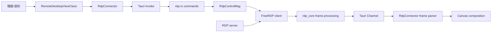
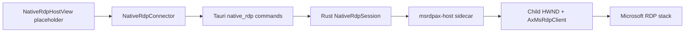

# RDP 架构

> **简体中文** | [English](../en/developer/rdp-architecture.md)

LazyTerm 维护两条共享应用级会话模型、但图形呈现完全不同的 RDP 路径：

| 路径 | 画面路径 | 平台 | 适用场景 |
| --- | --- | --- | --- |
| FreeRDP 内嵌 | Rust/FreeRDP 解码 → Tauri Channel → WebView Canvas | Windows、macOS、Linux（需原生依赖） | 与标签页、分屏和 WebView 交互统一 |
| MsTscAx sidecar | Microsoft RDP stack → 原生子窗口 | Windows | 更接近系统 RDP 客户端的兼容性与图形路径 |

`ConnectorFactory` 根据设置选择后端。非 Windows 平台始终解析为 `freerdp`。

## 共享应用层

两条路径都实现 `ISessionConnector`，并由以下组件共同管理：

- `tabs.ts`：应用级 `connectionStatus` 唯一数据源。
- `ConnectionSupervisor`：generation、错误分类、退避重连和最终失败。
- `ConnectionStateEmitter`：规范化 `phase`、`stage` 和 `health`。
- `ConnectionStatusOverlay`：连接中、重连和失败的用户界面。
- `RemoteDesktopViewClass`：选择 FreeRDP Canvas 或 `NativeRdpHostView`。

视图可以保留最后一帧或原生占位状态，但不能用这些视觉信息推导应用级连接结果。

## FreeRDP 内嵌路径

### 建连顺序

1. `RdpConnector` 预分配 UUID，并等待视图提供初始 viewport。
2. `BaseGraphicalConnector` 注册关闭监听器并建立二进制帧 Channel。
3. Readiness 标记 `identity` 与 `listeners` 后调用 `create_rdp_session`。
4. Rust 校验配置、创建 FreeRDP 客户端和控制通道，并等待连接启动结果。
5. 后端成功返回后标记 `backend` 与 `remote`，Connector 上报 `connected`。
6. 第一帧到达后标记 `first-data`，视图开始合成画面。

连接成功不依赖第一帧作为唯一信号；`first-data` 用于视觉就绪和问题定位。

### 帧格式与控制

- 后端通过 `Channel<Response>` 发送二进制区域帧。
- 帧头包含桌面尺寸、区域位置/尺寸、全帧标志和编码类型。
- 当前前端接受 JPEG 或 RGBA，按区域合成到 Canvas。
- 输入通过 `send_rdp_pointer`、`send_rdp_key` 和 `release_rdp_inputs` 进入控制通道。
- `request_rdp_refresh` 请求完整刷新，用于重连或画面不同步。
- `set_rdp_quality_policy` 根据会话可见性调整后端图像预算。

### 性能成本

- FreeRDP 解码和区域帧处理。
- 图像编码、内存拷贝与 Rust → WebView IPC。
- WebView 图像解码和 Canvas 合成。
- 高频指针输入的 command 调用。

维护时应优先减少全帧传输、重复编码和不可见会话的刷新频率，同时保证重连后能够请求可靠的完整画面。

## MsTscAx sidecar

MsTscAx 路径仅面向 Windows：

选择 sidecar 的原因：

- ActiveX 宿主需要 COM apartment、窗口消息循环和 Windows UI 生命周期。
- WinForms 对 RDP ActiveX 控件的宿主支持更成熟。
- 独立进程把 ActiveX 崩溃、stdout 状态协议和窗口控制与 Rust 主进程隔离。

sidecar 位于 `src-tauri/native/msrdpax-host`，发布输出由 Tauri 作为资源打包。

### 原生状态与窗口同步

`NativeRdpConnector` 除统一连接状态外，还维护更细的原生宿主状态，例如 `launching`、`host-ready`、`mounted`、`visible`、`focused`、`connected` 和 `closed`。这些状态用于挂载与画面呈现，不替代 `tabs.ts` 的连接状态。

`NativeRdpHostView` 负责测量 WebView 占位区域。`windowResizeCoordinator` 合并窗口、标签页、插槽和分屏变化，再通过 Connector 向后端发送：

- `mount`
- `overlay`
- `visible` / `hidden`
- `focus`
- `close`

前端不直接持有或操作 HWND。

### 必须处理的场景

- 切换到其他标签页或工作区时隐藏原生 surface。
- 应用最小化、恢复、移动到不同 DPI 显示器时重新同步矩形。
- 弹窗、标题栏或遮罩覆盖原生区域时更新 overlay。
- 调整分屏和插槽尺寸时合并高频布局请求。
- sidecar 异常退出时关闭当前 generation 并交给 Supervisor 判断是否重连。

## 重连与资源释放

- RDP 的可重试网络错误由 `ConnectionSupervisor` 安排自动重连。
- 每次重连创建新 Connector 和新 generation，旧事件不能覆盖新状态。
- FreeRDP 关闭时从 `AppState.rdp_sessions` 移除会话并发送 `RdpControlMsg::Close`。
- MsTscAx 关闭时先隐藏/关闭原生窗口，再终止 sidecar 并从 `native_rdp_sessions` 移除。
- 关闭页面或会话时必须清理 Tauri event 监听器、Channel 回调和尺寸协调请求。

## 构建边界

### FreeRDP

- Cargo 默认启用 `rdp-freerdp`。
- Windows 由 `FREERDP_ROOT` 或 include/lib 环境变量发现 FreeRDP 3。
- macOS/Linux 通过 `pkg-config` 查找 `freerdp3`、`freerdp-client3` 和 `winpr3`。
- 未发现依赖时编译会禁用 `freerdp_available` 路径并给出 warning。

### MsTscAx

- 仅 Windows 构建和打包。
- 需要 .NET SDK 8+ 构建 sidecar。
- 前端和通用 Rust 类型不得依赖 Windows HWND 类型。

环境准备见 [Windows 开发环境](./development-setup-windows.md)。

## 选择与维护建议

- 需要跨平台、分屏统一体验时优先 FreeRDP。
- 需要 Windows 原生 RDP 兼容性时可选择 MsTscAx。
- 修改共享连接状态时必须验证两条后端。
- 修改布局、DPI、弹窗或视图模式时重点验证 MsTscAx 原生窗口边界。
- 修改帧协议、刷新或质量策略时重点验证 FreeRDP Canvas 路径。
- 性能比较应区分协议解码、IPC、WebView 合成和原生呈现，不应用单一帧率结论替代分段测量。
