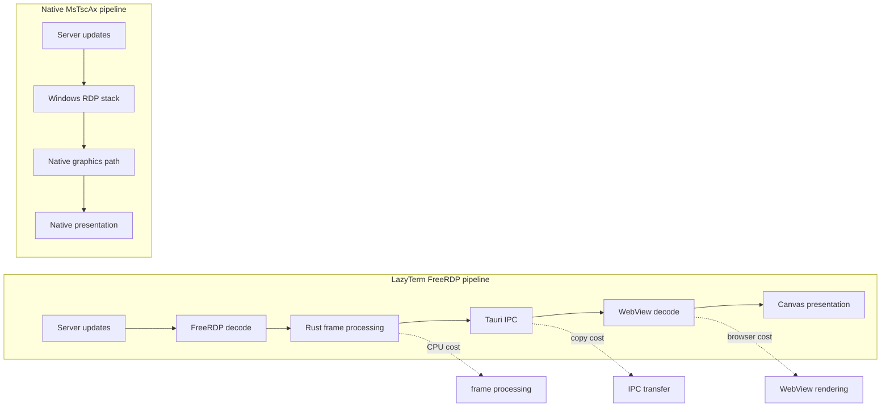

# RDP 架构

LazyTerm 当前维护两条 RDP 路径：

| 路径 | 说明 | 适用场景 |
| --- | --- | --- |
| FreeRDP 内嵌路径 | Rust 后端连接 RDP，前端 Canvas 展示帧 | 跨工作区统一标签页体验 |
| MsTscAx sidecar | Windows sidecar 托管 Microsoft RDP ActiveX 控件 | Windows 原生 RDP 能力和兼容性 |

## FreeRDP 内嵌路径

```text
RDP server
  -> FreeRDP client
  -> Rust frame processing
  -> Tauri IPC channel/event
  -> WebView decode
  -> Canvas presentation
```

这条路径的优势是能够留在 LazyTerm 标签页和分屏系统中。主要成本来自：

- Rust 侧帧处理。
- Rust 到 WebView 的 IPC 传输。
- WebView 中的图像解码和 Canvas 合成。

维护重点：

- 降低重复编码和拷贝。
- 控制交互时延。
- 保证标签页切换、窗口缩放和重连后画面状态正确。

## MsTscAx sidecar

MsTscAx 路径只面向 Windows。它通过独立 sidecar 进程托管 Microsoft RDP ActiveX 控件：

```text
React placeholder
  -> Tauri command
  -> Rust NativeRdpManager
  -> msrdpax-host sidecar
  -> child HWND + AxMsRdpClient
  -> Microsoft RDP stack
```

选择 sidecar 的原因：

- ActiveX 宿主需要 COM apartment、窗口消息循环、`IOleClientSite` 等 Windows UI 细节。
- WinForms/WPF 对 ActiveX 托管更成熟。
- Rust 后端只需要管理进程生命周期、窗口挂载、显示隐藏、尺寸同步和错误事件。

sidecar 位于：

```text
src-tauri/native/msrdpax-host
```

维护重点：

- 只在 Windows 构建和打包。
- 前端不暴露 HWND。
- 非活动标签页必须隐藏 native surface。
- 应用最小化、恢复、切换标签和调整分屏时同步窗口位置。

## 前端职责

前端只负责：

- 根据 RDP 后端选择视图。
- 为 native path 提供 placeholder。
- 测量 placeholder 位置和尺寸。
- 在标签激活、隐藏、缩放和点击时通知后端。

前端不负责：

- 直接管理 HWND。
- 直接托管 ActiveX。
- 直接读取或写入系统 RDP 配置文件。

## 后端职责

Rust 后端负责：

- 创建和关闭 RDP 会话。
- 管理 FreeRDP 连接状态。
- 管理 MsTscAx sidecar 进程。
- 转发挂载、隐藏、显示、聚焦和关闭命令。
- 把协议错误映射为前端可显示的连接错误。

## 性能路径对比



FreeRDP 内嵌路径换来统一工作区体验；Windows 原生路径换来更接近系统 RDP 客户端的性能和兼容性。
