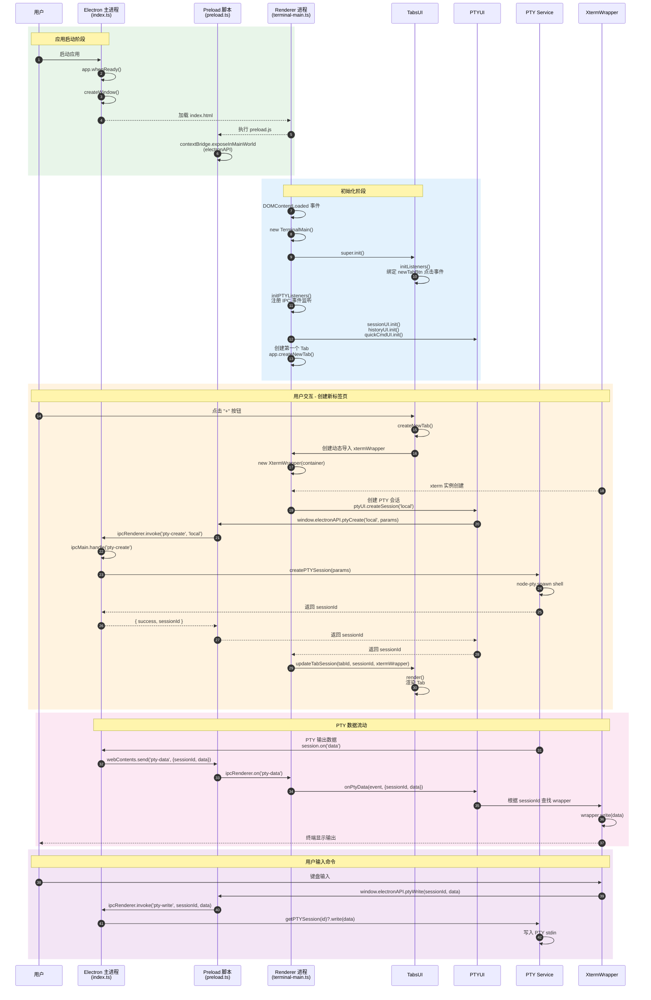
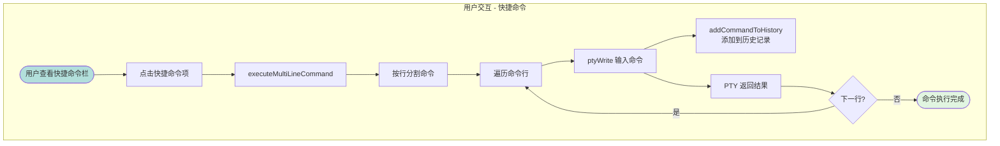
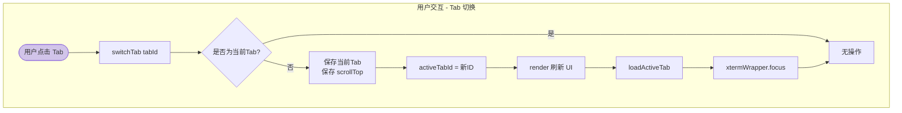
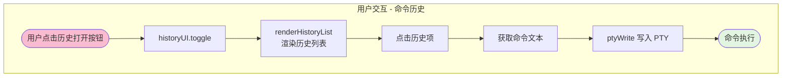
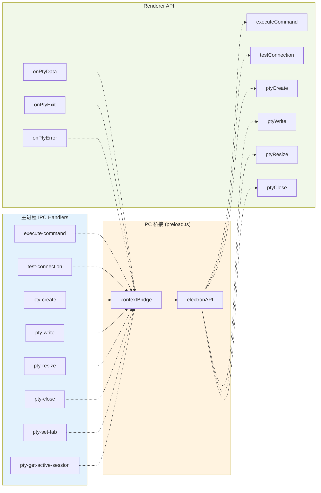

# Lazy Terminal 流程图和时序图

本文档包含 Lazy Terminal 应用的完整流程图和时序图，从 应用启动到用户交互的完整生命周期。

---

## 1. 主启动流程图

描述从 Electron 应用启动到第一个可交互终端就绪的完整初始化流程。

```mermaid
flowchart TD
    Start([启动 Electron 应用]) --> AppReady[app.whenReady]

    subgraph MainProcess["Electron 主进程"]
        AppReady --> CreateWindow[创建 BrowserWindow]
        CreateWindow --> SetPreferences[设置 webPreferences<br/>• preload.js<br/>• contextIsolation: true<br/>• nodeIntegration: false]
        SetPreferences --> SetMainWindow[setMainWindow]
        SetMainWindow --> LoadHTML[加载 renderer/index.html]
        LoadHTML --> RegisterIPC[注册 IPC 处理器<br/>• execute-command<br/>• pty-create<br/>• pty-write<br/>• pty-resize<br/>• pty-close<br/>• 等6个通道]
        RegisterIPC --> IPCReady[IPC 系统就绪]
    end

    IPCReady --> HTMLLoaded[index.html 加载完成]

    subgraph RendererProcess["Renderer 进程"]
        HTMLLoaded --> LoadBundle[加载 terminal-main.js<br/>ES6 模块]
        LoadBundle --> DOMContentLoaded[DOMContentLoaded 事件]
        DOMContentLoaded --> NewTerminalMain[new TerminalMain<br/>调用 TabsUI 构造函数]
        NewTerminalMain --> InitUI[UI 模块初始化]

        InitUI --> TabsInit[TabsUI.init<br/>设置 newTabBtn 监听器]
        TabsInit --> PTYListeners[initPTYListeners<br/>注册 onPtyData/Exit/Error]
        PTYListeners --> FontControls[initFontSizeControls<br/>设置字体控制]
        FontControls --> SessionUI[SessionUI.init<br/>设置会话管理]
        SessionUI --> HistoryUI[HistoryUI.init<br/>加载历史命令]
        HistoryUI --> QuickCmdUI[QuickCmdUI.init<br/>快捷命令栏]
        QuickCmdUI --> GlobalEvents[setupGlobalEventListeners]
        GlobalEvents --> ExposeWindow[暴露 window.app API]
        ExposeWindow --> CreateFirstTab[app.createNewTab<br/>创建第一个标签页]

        CreateFirstTab --> AsyncImport[动态导入 xtermWrapper]
        AsyncImport --> CreateXterm[创建 XtermWrapper 实例]
        CreateXterm --> PTYCreate[ptyUI.createSession]
        PTYCreate --> IPCInvoke[window.electronAPI.ptyCreate]
    end

    IPCInvoke --> MainProcessCreate[主进程 'pty-create' 处理]
    MainProcessCreate --> CreatePTY[createPTYSession<br/>或 createSSHSession]
    CreatePTY --> ReturnSessionId[返回 sessionId]
    ReturnSessionId --> UpdateTab[更新 TabData<br/>设置 xtermWrapper]
    UpdateTab --> RenderTab[渲染 Tab DOM 元素]
    RenderTab --> Complete([初始化完成<br/>可交互的终端])

    style Start fill:#e1f5e1
    style Complete fill:#e1f5e1
    style MainProcess fill:#e3f2fd
    style RendererProcess fill:#fff3e0
```



---

## 2. 时序图

展示主进程、预加载脚本、渲染进程和各个 UI 模块之间的时序交互。



---

## 3. 用户交互流程图

详细展示四个主要用户交互场景。

### 3.1 SSH 连接流程

```mermaid
flowchart TD
    subgraph "用户交互 - SSH 连接"
        SSHStart([用户打开 SSH 连接模态框]) --> SSHInput[填写连接参数<br/>host, port, user, auth]
        SSHInput --> TestConn[点击 "测试连接"]
        TestConn --> IPCTest[electronAPI.testConnection]
        IPCTest --> MainTest[主进程 test-connection]
        MainTest --> SSHConnect[ssh2 Client.connect]
        SSHConnect --> ConnResult{连接结果}
        ConnResult -->|成功| ShowSuccess[显示 "连接成功"]
        ConnResult -->|失败| ShowError[显示错误信息]
        ShowSuccess --> SaveSSHB[保存会话配置]
        ShowError --> SSHRetry[调整参数重试]
        SaveSSHB --> NewSSH[在新建 Tab 中打开 SSH 会话]
        NewSSH --> SSHPTYCreate[ptyUI.createSession 'ssh']
        SSHPTYCreate --> SSHMainCreate[主进程 createSSHSession]
        SSHMainCreate --> SSHStream[建立 SSH Stream]
        SSHStream --> SSHReady([SSH 终端就绪])
    end

    style SSHStart fill:#ffe0b2
    style SSHReady fill:#e1f5e1
```

### 3.2 快捷命令执行流程



### 3.3 Tab 切换流程



### 3.4 命令历史查看流程



---

## 4. 架构概览

### 4.1 IPC 通信通道



---

## 图表说明

### 主要流程图

**启动流程**：描述从 Electron 应用启动到第一个可交互终端就绪的完整初始化流程
- **主进程**：创建 BrowserWindow、配置 preload、注册 IPC 处理器
- **Renderer 进程**：加载模块、初始化 UI、创建第一个 Tab
- **PTY 创建**：通过 IPC 通信创建 PTY 会话并建立 Xterm 终端

### 时序图

展示主进程、预加载脚本、渲染进程和各个 UI 模块之间的时序交互

主要交互流程：
1. **启动阶段**：Electron 启动、preload 注入 API
2. **初始化阶段**：HTML 加载、DOM 事件、UI 模块初始化
3. **用户交互**：创建新标签页的完整流程
4. **PTY 数据流**：从 PTY Service 到 Xterm 的数据传输
5. **用户输入**：键盘输入到 PTY 的写入流程

### 用户交互子流程图

详细展示四个主要用户交互场景：
- **SSH 连接**：模态框 → 测试连接 → 保存 → 创建会话
- **快捷命令**：多行命令执行 → 历史记录
- **Tab 切换**：保存状态 → 切换 → 聚焦
- **命令历史**：查看历史 → 点击执行

---

## 技术语境

这些图表基于以下关键文件的深入分析：

### 主进程文件
- `src/main/index.ts` - Electron 主进程入口，负责窗口管理和 IPC 处理
- `src/main/preload.ts` - 预加载脚本，通过 contextBridge 暴露安全的 API

### Renderer 文件
- `src/renderer/index.html` - HTML 入口，加载应用
- `src/renderer/ui/terminal-main.ts` - 主控制器，协调所有 UI 模块
- `src/renderer/ui/tabs-ui.ts` - 标签页管理
- `src/renderer/ui/pty-ui.ts` - PTY 会话管理
- `src/renderer/ui/session-ui.ts` - SSH/会话管理
- `src/renderer/ui/history-ui.ts` - 命令历史管理
- `src/renderer/ui/quickcmd-ui.ts` - 快捷命令管理
- `src/renderer/ui/logger.ts` - 日志工具

### 核心依赖
- **Electron** - 桌面应用框架
- **node-pty** - 本地 PTY 模拟
- **ssh2** - SSH 连接库
- **xterm.js** - 终端模拟器

---

**生成日期**：2026-02-22
**应用名称**：Lazy Terminal
**版本**：1.0.0
