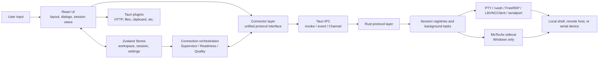
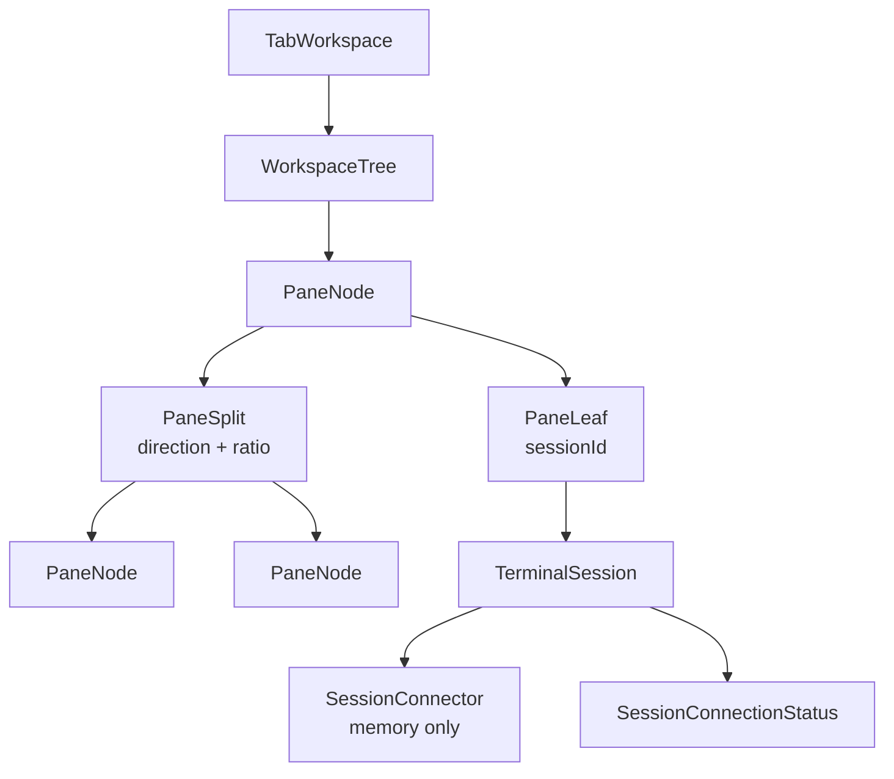

# Architecture Design

> [简体中文](../../developer/architecture.md) | **English**

| Field | Value |
| --- | --- |
| Status | Current implementation baseline |
| Version | `26.81.2912` |
| Last updated | 2026-08-12 |
| Scope | React frontend, session orchestration, Tauri IPC, Rust protocol backend, native boundaries, and persistence |

LazyTerm is a desktop terminal workspace built with Tauri 2, React 19, TypeScript, and Rust. Its central architecture is not merely “frontend calls backend.” Workspace layout, session state, connection lifecycle, and protocol resources are deliberately separated:

- A workspace determines where sessions are displayed.
- The session Store records the state visible to the application.
- Connectors provide a unified interface over protocol implementations.
- Connection services manage reconnects, failure classification, and resource budgets.
- The Rust backend owns the real PTYs, network connections, FFI clients, and sidecar processes.

## Design Principles

1. **UI does not depend directly on protocol commands**: session views operate through Connectors.
2. **One application-level source of connection state**: `connectionStatus` in `src/store/tabs.ts` determines the result shown by UI.
3. **Configuration is separate from runtime resources**: only serializable configuration is persisted; Connectors, listeners, task handles, and native resources are in memory.
4. **Listeners before backend startup**: fast failures, first frames, or close events must not race ahead of frontend subscriptions.
5. **Protocol differences stay behind boundaries**: Connectors and Rust `protocol` modules absorb RDP, VNC, SSH, and other differences.
6. **Background sessions reduce their workload**: graphical sessions adapt frame rate and image quality to focus, visibility, and document state.

## System Overview



### Layer Responsibilities

| Layer | Primary location | Responsibility | Must not own |
| --- | --- | --- | --- |
| Application and UI | `src/components/`, `src/hooks/` | Layout, input, presentation, and view lifecycle | Network connections or Rust handles |
| State | `src/store/` | Workspaces, sessions, configuration, and transient UI state | Protocol implementation |
| Application orchestration | `src/services/connection/`, `src/lib/` | Reconnects, failure classification, quality policy, workspace templates | Backend protocol resources |
| Connector | `src/connectors/` | Unified connection interface, event subscriptions, IPC conversion | Concrete UI rendering |
| IPC services | `src/services/tauri.ts`, other services | Invocation wrappers, logging, ordering, and application services | Session source-of-truth state |
| Rust backend | `src-tauri/src/protocol/` | PTY, network protocols, FFI, transfers, and system operations | Frontend layout decisions |
| Native boundary | `src-tauri/native/`, `*_ffi/` | Windows ActiveX sidecar, FreeRDP, and LibVNCClient integration | Exposing native handles to React |

Dependencies generally point downward. A few cross-Store interactions use explicit application functions—for example, session lifecycle coordination between `tabs.ts` and `panes.ts`. Components must not duplicate connection state.

## Technology Stack

| Area | Technology |
| --- | --- |
| Desktop runtime | Tauri 2 |
| Frontend | React 19, TypeScript 5.9, Vite 7 |
| State | Zustand 5 |
| UI | Tailwind CSS 4, Radix UI, shadcn/ui, Framer Motion, lucide-react |
| Terminal rendering | xterm.js 6 |
| Backend | Rust 2021, Tokio |
| Local terminal | portable-pty |
| SSH / SFTP | russh, russh-sftp |
| Embedded RDP | FreeRDP FFI |
| Native Windows RDP | MsTscAx sidecar |
| VNC | LibVNCClient FFI with a backend feature boundary |
| Serial | serialport |

## Workspace, Pane, and Session Models

Workspace layout and connection sessions are independent models:



- `tabs.ts` owns tabs, session metadata, Connector references, focused session, and connection status.
- `panes.ts` keeps a recursive pane tree per tab. Leaves reference `sessionId`; splits contain direction and ratio.
- `PaneContainer` renders the tree recursively. `PaneView` chooses terminal, RDP, or VNC presentation from the session type.
- `TabBar` registers lifecycle callbacks so session creation, removal, and focus changes update pane trees.
- Active tabs and pane trees are not persisted. Reusable layouts are captured as workspace templates and stored in the session tree configuration.
- A workspace template contains session definitions, recursive layout, ratios, focused session, and font overrides, but not plaintext credentials.

## Session Connection Architecture

### Unified Connector Interface

Every Connector implements `ISessionConnector`:

```text
open() / close() / onConnectionState() / applyQualityPolicy?()
```

Terminal protocols extend this as `ITerminalConnector` with `onData`, `write`, and `resize`. RDP, VNC, and native RDP expose their own frame, input, refresh, and mount capabilities.

| Session type | Connector | Frontend view | Rust / native implementation |
| --- | --- | --- | --- |
| Local terminal | `LocalConnector` | `TerminalViewClass` | portable-pty |
| SSH | `SshConnector` | `TerminalViewClass` | russh |
| AI CLI | `AiCliConnector` | `TerminalViewClass` | External CLI through portable-pty |
| Telnet | `TelnetConnector` | `TerminalViewClass` | Tokio TCP |
| Serial | `SerialConnector` | `TerminalViewClass` | serialport |
| RDP / FreeRDP | `RdpConnector` | `RemoteDesktopViewClass` | FreeRDP FFI plus canvas |
| RDP / MsTscAx | `NativeRdpConnector` | `NativeRdpHostView` | Windows sidecar plus native child window |
| VNC | `VncConnector` | `VncViewClass` | LibVNCClient FFI plus canvas |

`ConnectorFactory` is the single factory entry point from session type to implementation. It resolves credential references and selects FreeRDP or MsTscAx according to settings on Windows; non-Windows platforms force FreeRDP.

SFTP, application updates, Git sync, and AI conversations are not continuously rendered `SessionConnector` objects. They are command-style application services using Tauri commands or the Tauri HTTP plugin.

### Connection State Model

Connection state has three orthogonal dimensions:

| Dimension | Values | Purpose |
| --- | --- | --- |
| `phase` | `idle`, `connecting`, `authenticating`, `connected`, `reconnecting`, `disconnected`, `failed`, `closing` | User-visible lifecycle |
| `stage` | `idle`, `resolving`, `transport`, `security`, `authentication`, `session`, `first-data`, `steady`, `closing` | Where the current operation is happening |
| `health` | `unknown`, `healthy`, `degraded`, `stalled` | Current quality and usability |

`ConnectionStateEmitter` fills default `stage` and `health`. A Connector reports protocol observations; `ConnectionSupervisor` adds application fields such as `generation`, `attempt`, `retryAt`, and `terminal`. Finally, `tabs.ts` updates session state.

Views must not infer application connection results from `isConnected`, first-frame arrival, existing canvas content, or native-window state. First-frame, synchronization, and mounting may remain view-local states but cannot overwrite `connectionStatus`.

### Connection Ordering and Race Control

Typical connection flow:

```text
Create TerminalSession
  -> ConnectorFactory creates Connector
  -> ConnectionSupervisor registers a new generation
  -> Register data/frame/close/state listeners
  -> Connector.open()
  -> Tauri command creates Rust session
  -> Rust registers handles and starts read/write tasks
  -> Connector emits state
  -> tabs.ts updates the sole application connection state
  -> Session view consumes data and renders
```

`ConnectionReadinessBarrier` divides graphical connection readiness into checkpoints:

- `identity`: the frontend session identity is known.
- `listeners`: close, frame, and protocol-specific listeners are registered.
- `backend`: Rust resources exist.
- `remote`: the remote session is established.
- `first-data`: the first frame has arrived; this is visual readiness, not the sole connection-success condition.

Each connection has an independent `cycle` / `generation`. Late callbacks from an old connection cannot mutate a replacement connection or session.

### Disconnect and Reconnect Policy

`ConnectionSupervisor` centralizes reconnects:

- Recoverable SSH, Telnet, serial, RDP, and VNC failures reconnect automatically.
- At most six retries use base delays of 0.5, 1, 2, 4, 8, and 15 seconds with jitter.
- No more than two reconnects run concurrently, preventing a reconnect storm after network recovery.
- Network-dependent protocols queue while the browser is offline and resume on `online`.
- Thirty seconds of stable connection resets the retry counter.
- A non-retryable failure or exhausted retry limit sets `terminal: true`; the presentation layer then shows user guidance.
- An unexpected local-terminal exit causes `tabs.ts` to replace the Connector immediately. AI CLI output is retained and the CLI is not restarted automatically.
- Automatic and manual reconnects replace the Connector. The old Connector becomes stale before its backend resources and listeners are closed.

`connectionErrors.ts` converts failures into stable codes, categories, stages, and retryability. `connectionErrorService.ts` maps them into a user-facing summary, guidance, and technical details.

### Graphical Session Quality Scheduling

`ConnectionQualityScheduler` selects one of four policies from document visibility, pane visibility, and focused session:

| Mode | Typical state | Target FPS | JPEG quality cap | Suspend visuals |
| --- | --- | ---: | ---: | --- |
| `interactive` | Focused session | 60 | 85 | No |
| `balanced` | Visible but not focused | 30 | 72 | No |
| `background` | Currently invisible | 5 | 45 | No |
| `suspended` | Application document hidden | 1 | 25 | Yes |

Connectors optionally forward a policy through `applyQualityPolicy` to RDP/VNC backends. `PaneView` reports visibility; the scheduler owns the final decision.

## IPC and Data Channels

| Channel | Best for | Current uses |
| --- | --- | --- |
| Tauri `invoke` | Commands with an explicit result | Create/close, input, resize, SFTP, Git, updater |
| Per-session Tauri event | Text or low-rate state | Terminal output, close reason, VNC cursor/clipboard, native RDP state |
| Tauri `Channel<ArrayBuffer>` | High-rate binary streams | FreeRDP and VNC frames |
| Sidecar control channel | Native-window control | MsTscAx mount, position, overlay, visibility, focus, close |

`src/services/tauri.ts` exposes three invocation styles:

- `invokeTauri`: unified failure logging with a returned result.
- `invokeTauriSerialized`: queues operations such as writes and resize by session/operation key to preserve order.
- `invokeTauriBackground`: cleanup or controls that should not block UI.

Terminal data flow:

```text
Keyboard/paste -> xterm.js -> TerminalConnector.write
  -> serialized invoke -> Rust control channel -> PTY / SSH / Telnet / Serial

Remote output -> Rust reader task -> session event
  -> TerminalConnector.onData -> xterm.js
```

Embedded graphical data flow:

```text
Mouse/keyboard -> graphical view -> GraphicalConnector -> invoke -> Rust control channel

Remote update -> Rust decode/frame processing -> binary Channel
  -> Connector parses region frame -> Canvas composition
```

Native RDP does not copy desktop frames into the WebView. React owns a placeholder; `windowResizeCoordinator` coalesces window and layout changes, and Rust forwards geometry, visibility, and focus to the sidecar. See [RDP architecture](./rdp-architecture.md) for both RDP paths.

## Rust Backend

`src-tauri/src/lib.rs`:

- Initializes logging and Tauri plugins.
- Manages `AppState` and update-download state.
- Registers all Tauri commands.
- Starts the Tauri application.

`AppState` stores active handles per protocol: local terminal, SSH, Telnet, FreeRDP, VNC, and native RDP have separate registries; SFTP uploads and downloads store cancellation flags. Serial currently uses a process-level registry inside `serial.rs`.

Protocol commands normally validate parameters, create resources, or send messages into control channels. Continuous I/O runs in Tokio tasks or dedicated threads. Cleanup must remove the session from its registry and tell the worker to stop.

Backend layout:

```text
src-tauri/
  src/
    lib.rs                 # Tauri entry, plugins, command registration
    state.rs               # Active session registries
    types.rs               # IPC payloads and shared backend types
    error.rs               # Application error types
    logging.rs             # Backend logging
    protocol/
      terminal.rs          # Local PTY
      ssh.rs               # SSH shell
      ssh_auth.rs          # SSH connection and authentication
      sftp.rs              # SFTP upload, download, directory operations
      telnet.rs            # Telnet
      serial.rs            # Serial
      rdp.rs               # RDP commands
      rdp_core.rs          # FreeRDP loop and frame processing
      freerdp_client.rs     # Safe FreeRDP wrapper
      freerdp_ffi/          # FreeRDP C FFI
      vnc.rs                # VNC commands
      vnc_core.rs           # VNC orchestration
      vnc_client/           # VNC client, event loop, framebuffer
      vnc_ffi/              # LibVNCClient C FFI
      native_rdp.rs         # MsTscAx sidecar management
      git_sync.rs           # Git operations
      updater.rs            # Update download and install
  native/
    msrdpax-host/          # Native Windows RDP sidecar
    freerdp-runtime/       # Windows FreeRDP runtime files
  capabilities/            # Tauri permission boundary
```

## Frontend State and Persistence

### State Ownership

| State | Store / module | Lifetime | Git config file |
| --- | --- | --- | --- |
| Tabs, active sessions, Connectors, connection status | `tabs.ts` | Current process only | No |
| Pane trees, focused pane, temporary font overrides | `panes.ts` | Current process only | No |
| Notifications and settings-dialog state | `notifications.ts`, `settings-dialog.ts` | Current process only | No |
| Terminal and UI settings | `settings.ts` | localStorage | Yes |
| Session tree and workspace templates | `ssh-profiles.ts` | localStorage | Yes |
| Quick commands | `quick-commands.ts` | localStorage | Yes |
| Slot layout | `slot-config.ts` | localStorage | Yes |
| Encrypted credential vault | `credentials.ts` | localStorage | Yes |
| Command history | `history.ts` | localStorage | No |
| Connection-type ordering | `connection-type-order.ts` | localStorage | No |
| AI configuration and conversation | `ai.ts` | localStorage | No |
| Git path and last sync time | `git-sync.ts` | localStorage | No |

`localStorage` is the configuration source of truth. The name `gitAwareStorage` means a Store may participate in Git sync; it does not mean every Store update is written to Git automatically. A user-triggered sync bundles allowlisted keys into `lazy-term-config.json` at the repository root. Pulling from Git writes matching entries back to localStorage.

Active tabs and pane layout are not restored automatically. Workspace templates are the explicit cross-restart layout mechanism.

### Credential Boundary

- Session configuration prefers `credentialId`; the factory resolves actual secrets only while creating a Connector.
- Vault secrets use AES-GCM. Optional master passwords derive keys with PBKDF2-SHA-256.
- While locked, the Store exposes only credential metadata; decrypted values remain in current WebView memory.
- Workspace templates remove passwords, private-key contents, and passphrases, retaining only references.
- `lazy-term-config.json` may include the encrypted vault document, so sync code must never write decrypted or temporary connection configuration into ordinary Stores.

## Resource Cleanup and Platform Boundaries

- Closing a session unregisters it from the Supervisor and quality scheduler before the Connector cleans listeners and backend resources.
- A Rust close command must remove the session from its registry and send a stop control message.
- A graphical view may preserve the last frame while reconnecting, but a retained frame does not imply a live connection.
- Native RDP is Windows only. Inactive tabs, minimize/restore, pane changes, and overlays must synchronize with the sidecar.
- FreeRDP and LibVNCClient use FFI. Build availability depends on `build.rs`, Cargo features, and platform runtimes.
- Adding a Tauri plugin or expanding file, network, or window access requires a capabilities review, not only command registration.

## Frontend Layout

```text
src/
  components/
    layout/                # App shell, slots, tabs, recursive panes
    terminal/              # xterm, RDP, VNC, connection overlays
    dialogs/               # Connections, Quick Connect, SFTP, etc.
    modules/               # Session tree, history, quick commands, AI
    settings/              # Settings pages
    ui/                    # Reusable base components
  connectors/             # Protocol Connectors and ConnectorFactory
  services/
    connection/           # Supervisor, Readiness, Quality, failures
  store/                  # Zustand runtime and persistent Stores
  lib/                    # Workspace, credentials, layout, events
  hooks/                  # View mode, terminal, dialog hooks
  config/                 # Theme, update, default slot configuration
  types/                  # IPC, session, workspace-template types
  i18n/                   # User-visible strings
```

## Adding a Protocol

Maintain the boundaries in this order:

1. Add protocol, configuration, state, and Connector types in `src/types/terminal.ts`.
2. Implement the Connector and report state through `ConnectionStateEmitter`.
3. Add a branch in `ConnectorFactory.ts`; pass only temporarily resolved credentials.
4. Integrate the type into `tabs.ts`, the session tree, forms, and i18n.
5. Add view dispatch to `PaneView`; reuse `TerminalViewClass` or shared graphical capabilities when possible.
6. Implement commands, workers, and cleanup in `src-tauri/src/protocol/`, then register commands in `lib.rs`.
7. Update capabilities, build scripts, bundle resources, and platform checks for new permissions or native libraries.
8. Add stable error codes and retryability rules to failure classification.
9. Integrate graphical protocols with Readiness, Quality, visibility, and full-frame refresh.
10. Run `tsc --noEmit` and `cargo check`, then have a maintainer perform a focused real-connection check.

## Maintenance Constraints

- Do not call protocol commands directly from view components; extend a Connector or Service.
- Do not persist Connectors, listener cleanup functions, Promises, Channels, window handles, or Rust handles.
- Do not replace unified `connectionStatus` with protocol-specific booleans.
- Do not start an event-producing backend before required listeners are registered.
- Do not allow old-generation asynchronous results to overwrite the current connection.
- When adding user-visible connection failures, update classification, presentation mapping, and every UI language.
- Changes to either RDP backend must preserve the boundary between canvas and native-host paths.

## Related Documents

- [RDP architecture](./rdp-architecture.md)
- [Terminal view component architecture](../../../src/components/terminal/README.md) (Chinese)
- [View modes](./view-modes.md)
- [Windows development setup](./development-setup-windows.md)
- [Development workflow](./development-workflow.md)
