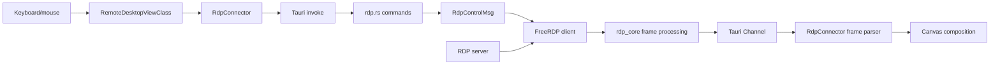
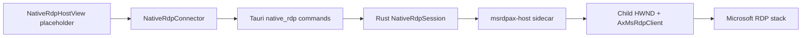

# RDP Architecture

> [简体中文](../../developer/rdp-architecture.md) | **English**

LazyTerm maintains two RDP paths that share the application session model but have completely different presentation pipelines:

| Path | Presentation pipeline | Platforms | Best suited for |
| --- | --- | --- | --- |
| Embedded FreeRDP | Rust/FreeRDP decode → Tauri Channel → WebView canvas | Windows, macOS, Linux with native dependencies | Unified tabs, panes, and WebView interaction |
| MsTscAx sidecar | Microsoft RDP stack → native child window | Windows | Compatibility and graphics behavior close to the system RDP client |

`ConnectorFactory` selects the backend from settings. Non-Windows platforms always resolve to `freerdp`.

## Shared Application Layer

Both paths implement `ISessionConnector` and share:

- `tabs.ts`: the application source of truth for `connectionStatus`.
- `ConnectionSupervisor`: generations, error classification, backoff reconnects, and terminal failure.
- `ConnectionStateEmitter`: normalized `phase`, `stage`, and `health`.
- `ConnectionStatusOverlay`: UI for connecting, reconnecting, and failure.
- `RemoteDesktopViewClass`: selection between FreeRDP canvas and `NativeRdpHostView`.

A view may retain the last frame or native placeholder state, but visual state must not infer application-level connection success.

## Embedded FreeRDP Path

### Connection Order

1. `RdpConnector` allocates a UUID and waits for an initial viewport from the view.
2. `BaseGraphicalConnector` registers the close listener and creates the binary frame Channel.
3. Readiness marks `identity` and `listeners`, then invokes `create_rdp_session`.
4. Rust validates configuration, creates the FreeRDP client and control channel, and waits for startup result.
5. A successful backend return marks `backend` and `remote`; the Connector reports `connected`.
6. The first frame marks `first-data` and canvas composition starts.

The first frame is not the sole definition of connection success; `first-data` is a visual-readiness and diagnostic checkpoint.

### Frames and Control

- The backend sends binary region frames through `Channel<Response>`.
- The frame header includes desktop size, region position/size, full-frame flag, and encoding.
- The frontend currently accepts JPEG or RGBA and composes regions into a canvas.
- Input uses `send_rdp_pointer`, `send_rdp_key`, and `release_rdp_inputs` through a control channel.
- `request_rdp_refresh` requests a full refresh after reconnect or visual desynchronization.
- `set_rdp_quality_policy` adjusts backend image budget based on session visibility.

### Performance Costs

- FreeRDP decode and region processing.
- Image encoding, memory copies, and Rust-to-WebView IPC.
- WebView image decode and canvas composition.
- Command overhead for frequent pointer input.

Maintenance should minimize full-frame transfers, duplicate encoding, and invisible-session refresh rates while retaining a reliable full refresh after reconnect.

## MsTscAx Sidecar

The MsTscAx path is Windows only:

The sidecar exists because:

- ActiveX hosting requires COM apartments, a Windows message loop, and native UI lifecycle management.
- WinForms provides mature hosting for the RDP ActiveX control.
- A separate process isolates ActiveX crashes, the stdout state protocol, and window control from the Rust process.

The sidecar lives under `src-tauri/native/msrdpax-host`; Tauri bundles its published output as a resource.

### Native State and Window Synchronization

In addition to unified connection state, `NativeRdpConnector` tracks host states such as `launching`, `host-ready`, `mounted`, `visible`, `focused`, `connected`, and `closed`. They control mounting and presentation but do not replace `tabs.ts` state.

`NativeRdpHostView` measures a WebView placeholder. `windowResizeCoordinator` coalesces window, tab, slot, and pane changes before the Connector sends:

- `mount`
- `overlay`
- `visible` / `hidden`
- `focus`
- `close`

The frontend never owns or manipulates HWND values directly.

### Required Scenarios

- Hide the native surface when switching to another tab or workspace.
- Resynchronize the rectangle after minimize/restore or moving between displays with different DPI.
- Update overlay geometry when dialogs, title bars, or masks cover the native region.
- Coalesce high-frequency requests while resizing panes or slots.
- Treat an unexpected sidecar exit as a close for the current generation and let the Supervisor decide whether to reconnect.

## Reconnects and Cleanup

- `ConnectionSupervisor` schedules reconnects for retryable RDP network failures.
- Every reconnect creates a new Connector and generation; old events cannot overwrite current state.
- FreeRDP cleanup removes the session from `AppState.rdp_sessions` and sends `RdpControlMsg::Close`.
- MsTscAx cleanup hides/closes the native window, terminates the sidecar, and removes `native_rdp_sessions` state.
- Closing a page or session must remove Tauri listeners, Channel callbacks, and pending geometry work.

## Build Boundaries

### FreeRDP

- Cargo enables `rdp-freerdp` by default.
- Windows discovers FreeRDP 3 through `FREERDP_ROOT` or include/lib variables.
- macOS/Linux use `pkg-config` for `freerdp3`, `freerdp-client3`, and `winpr3`.
- Missing dependencies disable the `freerdp_available` path with a warning.

### MsTscAx

- Built and packaged only on Windows.
- Requires .NET SDK 8+ to build the sidecar.
- Generic frontend and Rust types must not depend on Windows HWND types.

See [Windows development setup](./development-setup-windows.md).

## Selection and Maintenance Guidance

- Prefer FreeRDP for cross-platform, unified split-pane behavior.
- Select MsTscAx when native Windows RDP compatibility is more important.
- Changes to shared connection state must verify both backends.
- Layout, DPI, dialogs, and view-mode changes need special MsTscAx validation.
- Frame protocol, refresh, and quality-policy changes need special FreeRDP canvas validation.
- Performance analysis should separate protocol decode, IPC, WebView composition, and native presentation rather than reducing the comparison to one frame-rate number.
