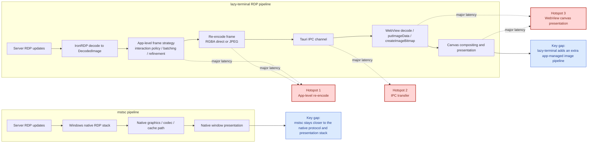

# RDP Pipeline Comparison

## Notes

- Hotspot 1 is where lazy-terminal still pays the largest CPU cost when frames are re-packed for the frontend.
- Hotspot 2 is the extra copy and transport layer between Rust and the WebView.
- Hotspot 3 is the browser-side rendering path, which mstsc does not have.